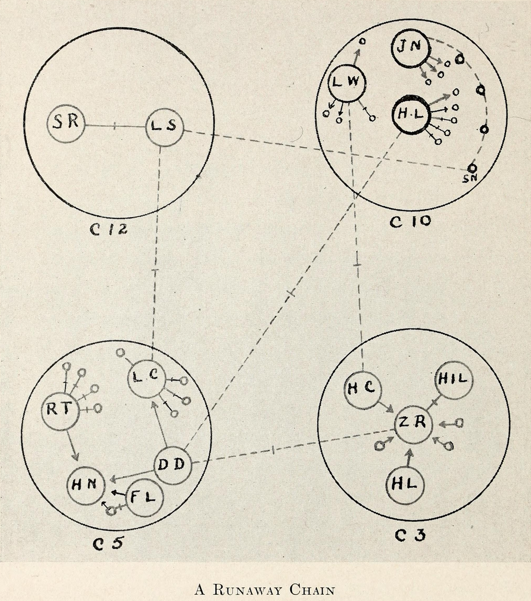

```{r xaringan-themer, include = FALSE}
# servr::daemon_stop(1)

# What packages do you need?
library(xaringanthemer)
library(fontawesome)
library(RefManageR)

library(visNetwork)
library(statnet)

# set fonts if on windows
if(.Platform$OS.type == "windows"){
  windowsFonts(Montserrat=windowsFont("MONTSERRAT-REGULAR"))
}

# set xaringanthemer theme configs
duo(
  primary_color = "#362c47", secondary_color = "#ff7400",
  header_font_google = google_font("Josefin Sans"),
  text_font_google   = google_font("Montserrat", "300", "300i"),
  code_font_google   = google_font("Droid Mono")
)

# For citations
options(htmltools.dir.version = FALSE)
RefManageR::BibOptions(check.entries = FALSE, bib.style = "authoryear", style = "markdown", dashed = TRUE)
bib <- RefManageR::ReadBib("../../../../../../ZoteroDB/zotero_short.bib")
```

layout: true

<div class="my-footer">
<website>
jnjoseph.com
</website>
<event-name>
IST008A
</event-name>
</div>

---

class: left, top
background-image: url(resources/title_bg.jpg)
background-size: cover

# Intro to Social Network Analysis (SNA)
## Jared Joseph
`r format(Sys.time(), '%B %d, %Y')`

<br>
<br>
<br>
<br>

### While you wait:

* Make sure you have installed: statnet, igraph, tidygraph, and intergraph
* Play around with https://oracleofbacon.org/

---

# Learning Objectives
.huge[
-   What a network is.

-   What is and is not relational data.

-   How vulnerable SNA is to missing data.

-   What common network analysis metrics are available and how to interpret them.

-   The limitations and shortcomings of social network analysis.
]

???

---

# Roadmap

.huge[
-   What is Social Network Analysis (SNA)

-   Examples of networks in research

-   SNA Data

-   Network (graph) level properties

-   Individual (node) level properties

-   SNA Tools

-   Guided Homework Start/Question Time
]

---

# What is Social Network Analysis (SNA)

.center[.large[A tool to work with *relational* data.]]

--

.center[
```{r echo=FALSE, out.width='50%'}
knitr::include_graphics("resources/df_img.png")
```
]

???

A method to look at relational data

You should be familiar with data that looks like this now

Square table with rows and columns, and this is a good, tidy way to keep data

---

# What is Social Network Analysis (SNA)

.center[.large[A tool to work with *relational* data.]]

.center[
```{r echo=FALSE, out.width='200%'}
nodes = data.frame(id = 1:4, 
                    shape = "image",
                    title = c("<p style='color: black;'>A<br>28<br>1</p>", "<p style='color: black;'>Y<br>21<br>3</p>", "<p style='color: black;'>G<br>32<br>4</p>", "<p style='color: black;'>Z<br>48<br>8</p>"),
                    image = c("https://emojipedia-us.s3.dualstack.us-west-1.amazonaws.com/thumbs/120/microsoft/209/male-teacher_1f468-200d-1f3eb.png", "https://emojipedia-us.s3.dualstack.us-west-1.amazonaws.com/thumbs/120/microsoft/209/male-student_1f468-200d-1f393.png", "https://emojipedia-us.s3.dualstack.us-west-1.amazonaws.com/thumbs/120/microsoft/209/female-health-worker_1f469-200d-2695-fe0f.png", "https://emojipedia-us.s3.dualstack.us-west-1.amazonaws.com/thumbs/120/microsoft/209/male-scientist_1f468-200d-1f52c.png"))

edges = data.frame(from = c(2,4,3,3), to = c(1,2,4,2), label = c("Siblings", "Student", "Friends", "Parent"))

visNetwork(nodes, edges, width = "100%") %>% 
  visNodes(shapeProperties = list(useBorderWithImage = FALSE), size = 50) %>%
  visEdges(length = 200, scaling = list(min = 400)) %>%
  visInteraction(zoomView = FALSE) %>%
  visLayout(randomSeed = 2)
```
]

???

Rather than looking only at attributes of specific data points, we are looking at the connections between data.

IN SNA, data points are called **nodes**, and the connections between them are called **edges**.

These components create a **network** or graph, defined by `r Citet(bib, "wassermanSocialNetworkAnalysis1994")` as "finite set or sets of actors and the relation or relations defined on them."

---

# Networks in research - Social Sciences

.center[
```{r echo=FALSE, out.width='40%'}

```
]

.footnote[`r Citet(bib, "morenoWhoShallSurvive1953")`]

???

One of the first instances of SNA was originally published in 1932 in Jacob Moreno's "Who Shall Survive"

Focused on runaway girls at a correctional school, and how their associations could predict running away more than any attributes of the individual children.

Since then, networks have been used in the social sciences, but only really picked up as the tools to understand SNA became more available.

---

# Networks in research - Neuroscience

.center[
```{r echo=FALSE, out.width='60%'}
knitr::include_graphics("resources/neuronet.jpg")
```
]

.footnote[`r Citet(bib, "bassettNetworkNeuroscience2017")`]

???

Neuroscientists use networks (or graphs) to study the brain

useful for understanding how neurons and neuron clusters work

---

# Networks in research - Chemestry

.center[
```{r echo=FALSE, out.width='60%'}
knitr::include_graphics("resources/chem_graph.jpg")
```
]

.footnote[`r Citet(bib, "balabanApplicationsGraphTheory1985")`]

???

Chemistry was quick to see the use, as early at 1985 seeing the similarities between molecules and networks

---

# Networks in research - The Internet

.center[
```{r echo=FALSE, out.width='55%'}
knitr::include_graphics("resources/page_rank.jpg")
```
]

.footnote[`r Citet(bib, "pageMethodNodeRanking2001")`]

???

Web pages and search engines ARE networks. 

Page rank is a network metric and was how google sorted pages for a long time.

---

# Networks in research - Infastructure

.center[
```{r echo=FALSE, out.width='65%'}
knitr::include_graphics("resources/infrastructure_net.jpg")
```
]

.footnote[`r Citet(bib, "fanGraphbasedMethodSocial2019")`]

???

Governments and utilities use social network data to try and find where infrastrucutre is failing during disasters

---

# Networks in research - Security

.center[
```{r echo=FALSE, out.width='65%'}
knitr::include_graphics("resources/terror_net.png")
```
]

.footnote[`r Citet(bib, "krebsMappingNetworksTerrorist2002")`]

???

Topic we will get to more later: networks are also sometimes used offensively.

Network metrics such as "keyplayer" are used to show what node in a network, when removed, would fragment the network fastest

---

class: center, middle

# Questions so far?

---

# Graph Level Properties

.huge[
* Directed or Un-directed

* Density

* Centralization
]

???

Now that we know what networks are and some example of how they are used, let's get into actually analyzing them.

---

# Directed or Un-directed

.pull-left[
```{r Directionality, echo=FALSE}
.dir_node = data.frame("id" = 1:10)
.dir_edge = data.frame("from" = c(3, 8, 1, 5, 6, 8, 2, 3, 4, 7, 2, 4, 3, 4, 3), "to" = c(1, 1, 2, 2, 2, 2, 4, 5, 5, 6, 7, 8, 9, 9, 10))
.dir_edge$arrows = sample(c("to", "to;from"), 15, replace = TRUE)

visNetwork(.dir_node, .dir_edge, main = "Directed")
```
]

.pull-right[
```{r echo=FALSE}
visNetwork(.dir_node, .dir_edge[,1:2], main = "Un-directed")
```

]

???

One of the first graph level properties we need to understand is if it is directed or undirected.

Directed - tracks what node is sending something to another node, undirected considers all edges to be mutual. Facebook or twitter.

Which one you may find useful largely depends on what you are interested in, and the data you are using.

---

# Density

.pull-left[
```{r echo=FALSE}
visNetwork(.dir_node, .dir_edge, main = "High Density")
```
]

.pull-right[
```{r echo=FALSE}
visNetwork(.dir_node, .dir_edge[c(1:5,7,10,13,15),], main = "Low Density")
```
]

???

Density is a measure of how many edges exist in a network out of the total possible edge count, using $\frac{Actual Edges}{Possible Edges}$. 

Networks that are more densely connected are considered to be more cohesive, and robust, in that the removal of any specific edge will not have a great effect of the network as a whole.

It also means that, given the nodes being individuals, each node will have a more direct route to resources that may be present in the network, as they know more individuals who may have the resource they are looking for, or will have a greater chance of knowing someone else who does.

---

# Centralization

.pull-left[
```{r echo=FALSE}
.star_edge = data.frame("from" = c(1,2,3,4,5), "to" = c(6,6,6,6,6))

visNetwork(data.frame("id" = 1:6), .star_edge, main = "Star Network")
```
]

.pull-right[
```{r echo=FALSE}
.loop_edge = data.frame("from" = c(1,2,3,4,5,6), "to" = c(2,3,4,5,6,1))

visNetwork(data.frame("id" = 1:6), .loop_edge, main = "Loop Network")
```
]

???

**Centralization** measures give a sense of the shape of the network, namely how other measures are distributed in a network. Consider the three networks below. The first "Star" network would be considered highly centralized, as one node connects all the others. It would receive a degree centralization score of 1, as 100% of the ties are connected with one node. The loop network would have a score of 0, as every node is equally connected to each other.
```{r Centralization}
## Networks created manually, to assure the propper shape
#ce.star = matrix(data = c(0,1,1,1,1,1,1,0,0,0,0,0,1,0,0,0,0,0,1,0,0,0,0,0,1,0,0,0,0,0,1,0,0,0,0,0), nrow = 6, ncol = 6)
#ce.star = network(ce.star, matrix.type = "adjacency", directed = FALSE)
#
#ce.line = matrix(data = c(0,0,0,0,0,0,1,0,0,0,0,0,0,1,0,0,0,0,0,0,1,0,0,0,0,0,0,1,0,0,0,0,0,0,1,0), nrow = 6, ncol = 6)
#ce.line = network(ce.line, matrix.type = "adjacency", directed = FALSE)
#
#ce.circle = matrix(data = c(0,0,0,0,0,0,1,0,0,0,0,0,0,1,0,0,0,0,0,0,1,0,0,0,0,0,0,1,0,0,1,0,0,0,1,0), nrow = 6, ncol = 6)
#ce.circle = network(ce.circle, matrix.type = "adjacency", directed = FALSE)
#
#par(mfrow=c(1,3))
#plot(ce.star, main = "Star", vertex.cex = 3)
#plot(ce.line, main = "Line", vertex.cex = 3)
#plot(ce.circle, main = "Circle", vertex.cex = 3)
```


---

# Methods

My custom font sizes

.colossal[colossal]
.gargantuan[gargantuan]
.huge[huge]
.large[large]
.small[small]
.tiny[tiny]
.diminutive[diminutive]

---

# Conclusion

---

# Thank you!
.pull-left[

<br>

### [`r fa(name = "twitter", fill = "#FFFFFF")` @epsian](http://twitter.com/epsian)  
### [`r fa(name = "github", fill = "#FFFFFF")` @epsian](http://github.com/epsian)  
### [`r fa(name = "link", fill = "#FFFFFF")` jnjoseph.com](https://jnjoseph.com)  
### [`r fa(name = "paper-plane", fill = "#FFFFFF")` jnjoseph@ucdavis.edu](mailto:jnjoseph@ucdavis.edu)

]

.pull-right[
.center[
```{r echo=FALSE, out.width='100%', out.extra='style="background-color: #FFF; padding:5px;position: relative; top: -60px"'}
knitr::include_graphics("resources/prof_photo.jpg")
```
]
]

---

# References

```{r, results='asis', echo=FALSE}
PrintBibliography(bib)
```


