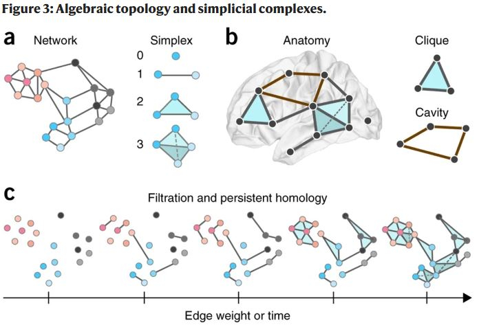

```{r xaringan-themer, include = FALSE}
# servr::daemon_stop(1)

# What packages do you need?
library(xaringanthemer)
library(fontawesome)
library(RefManageR)

library(visNetwork)


# set fonts if on windows
if(.Platform$OS.type == "windows"){
  windowsFonts(Montserrat=windowsFont("MONTSERRAT-REGULAR"))
}

# set xaringanthemer theme configs
duo(
  primary_color = "#362c47", secondary_color = "#ff7400",
  header_font_google = google_font("Josefin Sans"),
  text_font_google   = google_font("Montserrat", "300", "300i"),
  code_font_google   = google_font("Droid Mono")
)

# For citations
options(htmltools.dir.version = FALSE)
RefManageR::BibOptions(check.entries = FALSE, bib.style = "authoryear", style = "markdown", dashed = TRUE)
bib <- RefManageR::ReadBib("../../../../../../ZoteroDB/zotero_short.bib")
```

layout: true

<div class="my-footer">
<website>
jnjoseph.com
</website>
<event-name>
IST008A
</event-name>
</div>

---

class: left, top
background-image: url(resources/title_bg.jpg)
background-size: cover

# Intro to Social Network Analysis (SNA)
## Jared Joseph
`r format(Sys.time(), '%B %d, %Y')`

<br>
<br>
<br>
<br>

### While you wait:

* Make sure you have installed: statnet, igraph, tidygraph, and intergraph
* Play around with https://oracleofbacon.org/

---

# Learning Objectives
.huge[
-   What a network is.
-   What is and is not relational data.
-   How vulnerable SNA is to missing data.
-   What common network analysis metrics are available and how to interpret them.
-   The limitations and shortcomings of social network analysis.
]

???

---

# Roadmap

.huge[
-   What is Social Network Analysis (SNA)
-   Examples of networks in research
-   SNA Data
-   Network (graph) level properties
-   Individual (node) level properties
-   SNA Tools
-   Guided Homework Start/Question Time
]

---

# What is Social Network Analysis (SNA)

.center[.large[A tool to work with *relational* data.]]

--

.center[
```{r echo=FALSE, out.width='50%'}
knitr::include_graphics("resources/df_img.png")
```
]

???

A method to look at relational data.

Rather than looking only at attributes of specific data points, we are looking at the connections between data.

IN SNA, data points are called **nodes**, and the connections between them are called **edges**.

These components create a **network**, defined by [Wasserman & Faust (1994)](http://www.cambridge.org/us/academic/subjects/sociology/sociology-general-interest/social-network-analysis-methods-and-applications?format=PB) as "finite set or sets of actors and the relation or relations defined on them."

---

# What is Social Network Analysis (SNA)

.center[.large[A tool to work with *relational* data.]]

.center[
```{r echo=FALSE, out.width='200%'}
nodes = data.frame(id = 1:4, 
                    shape = "image",
                    image = c("https://emojipedia-us.s3.dualstack.us-west-1.amazonaws.com/thumbs/120/microsoft/209/male-teacher_1f468-200d-1f3eb.png", "https://emojipedia-us.s3.dualstack.us-west-1.amazonaws.com/thumbs/120/microsoft/209/male-student_1f468-200d-1f393.png", "https://emojipedia-us.s3.dualstack.us-west-1.amazonaws.com/thumbs/120/microsoft/209/female-health-worker_1f469-200d-2695-fe0f.png", "https://emojipedia-us.s3.dualstack.us-west-1.amazonaws.com/thumbs/120/microsoft/209/female-scientist_1f469-200d-1f52c.png"))

edges = data.frame(from = c(2,4,3,3), to = c(1,2,4,2), label = c("Siblings", "Student", "Friends", "Parent"))

visNetwork(nodes, edges, width = "100%") %>% 
  visNodes(shapeProperties = list(useBorderWithImage = FALSE), size = 50) %>%
  visEdges(length = 200, scaling = list(min = 400)) %>%
  visLayout(randomSeed = 2)
```
]

---

# Networks in research - Social Sciences

.center[
```{r echo=FALSE, out.width='40%'}
knitr::include_graphics("resources/who_shall_survive.png")
```
]

.footnote[`r Citet(bib, "morenoWhoShallSurvive1953")`]

???

One of the first instances of SNA was originally published in 1932 in Jacob Moreno's "Who Shall Survive"

Focused on runaway girls at a correctional school, and how their associations could predict running away more than any attributes of the individual children.

Since then, networks have been used in the social sciences, but only really picked up as the tools to understand SNA became more available.

---

# Networks in research - Neuroscience

.center[
```{r echo=FALSE, out.width='60%'}

```
]

.footnote[`r Citet(bib, "bassettNetworkNeuroscience2017")`]

???

Neuroscientists use networks (or graphs) to study the brain

useful for understanding how neurons and neuron clusters work

---

# Networks in research - Chemestry

.center[
```{r echo=FALSE, out.width='60%'}
knitr::include_graphics("resources/chem_graph.jpg")
```
]

.footnote[`r Citet(bib, "balabanApplicationsGraphTheory1985")`]

???

Chemistry was quick to see the use, as early at 1985 seeing the similarities between molocules and networks

---

# Networks in research - The Internet


---

# Networks in research - Infastructure

---

# Networks in research - Security

---


---

# Methods

My custom font sizes

.colossal[colossal]
.gargantuan[gargantuan]
.huge[huge]
.large[large]
.small[small]
.tiny[tiny]
.diminutive[diminutive]

---

# Conclusion

---

# Thank you!
.pull-left[

<br>

### [`r fa(name = "twitter", fill = "#FFFFFF")` @epsian](http://twitter.com/epsian)  
### [`r fa(name = "github", fill = "#FFFFFF")` @epsian](http://github.com/epsian)  
### [`r fa(name = "link", fill = "#FFFFFF")` jnjoseph.com](https://jnjoseph.com)  
### [`r fa(name = "paper-plane", fill = "#FFFFFF")` jnjoseph@ucdavis.edu](mailto:jnjoseph@ucdavis.edu)

]

.pull-right[
.center[
```{r echo=FALSE, out.width='100%', out.extra='style="background-color: #FFF; padding:5px;position: relative; top: -60px"'}
knitr::include_graphics("resources/prof_photo.jpg")
```
]
]

---

# References

```{r, results='asis', echo=FALSE}
PrintBibliography(bib)
```


